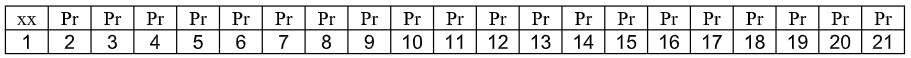
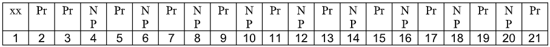
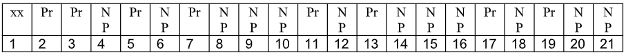
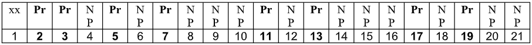

# Sieve-of-Eratosthenes

Write a program that computes prime numbers using the “Sieve of Eratosthenes” method. The Sieve prime number generator uses an ingenious method, which does not involve any type of division, by using the following steps:

1. Initialize all numbers in the array, starting with 2, as prime numbers. Ignore number 1.

2. Check the first number, 2, to see if it is prime.
Since it is designated prime, change all the multiples of 2 to Not Prime.

3. Check the next number, 3, to see if it is prime.
Since it is designated prime, change all the multiple of 3 to Not Prime.

4. Continue this process, until the upper limit is reached.

<br></br>
**Example:**

Imagine that a small upper limit of 21 is requested.
The “Sieve” will work with Pr (Prime) and NP (Not Prime) as follows:

STEP 1: Initialize all elements to Prime



STEP 2: Change all multiples of 2 to Not Prime


STEP 3: Change all multiples of 3 to Not Prime


STEP 4: Repeat this process until the upper limit is reached


Prime Numbers left are: 2, 3, 5 ,7, 11, 13, 17, 19

## 80 Point Version Specifics
The 80-point version displays all the prime numbers between 1 and 100. Complete methods
ComputePrimes and DisplayPrimes inside the Main class. There is only a single execution
and there is no program user input at all.

```java
public class Main{
    public static void main(String[] args){
        final int MAX = 100;
        boolean primes[];
        primes = new boolean[MAX];
        computePrimes(primes);
        displayPrimes(primes);
    }
}
```
Output:
```
PRIMES BETWEEN 1 AND 100:
2 3 5 7 11 13 17 19 23 29 31 37 41 43 47 53 59 61 67 71 73 79 83 89 97
```


## 100 Point Version Specifics
The 100-point version requires interactive input in a text window. Additionally, the 100-point version needs to format program output so that all prime numbers display four digit numbers with leading zeroes where necessary using the DecimalFormat of class. To make the output look proper 1 blank space needs to be printed after each number. Execute the program twice. You are expected to do research on this class and use it for the 100-point version.


100 Point Version Outputs (2 required)

First Output

```
Enter the primes upper bound: 1000

PRIMES BETWEEN 1 AND 1000
0002 0003 0005 0007 0011 0013 0017 0019 0023 0029 0031 0037 0041 0043 0047 0053 0059 0061 0067 0071 0073 0079 0083 0089 0097 0101 0103 0107 0109 0113 0127 0131 0137 0139 0149 0151 0157 0163 0167 0173 0179 0181 0191 0193 0197 0199 0211 0223 0227 0229 0233 0239 0241 0251 0257 0263 0269 0271 0277 0281 0283 0293 0307 0311 0313 0317 0331 0337 0347 0349 0353 0359 0367 0373 0379 0383 0389 0397 0401 0409 0419 0421 0431 0433 0439 0443 0449 0457 0461 0463 0467 0479 0487 0491 0499 0503 0509 0521 0523 0541 0547 0557 0563 0569 0571 0577 0587 0593 0599 0601 0607 0613 0617 0619 0631 0641 0643 0647 0653 0659 0661 0673 0677 0683 0691 0701 0709 0719 0727 0733 0739 0743 0751 0757 0761 0769 0773 0787 0797 0809 0811 0821 0823 0827 0829 0839 0853 0857 0859 0863 0877 0881 0883 0887 0907 0911 0919 0929 0937 0941 0947 0953 0967 0971 0977 0983 0991 0997 
```
<br></br>
Second Output:
```
Enter the primes upper bound: 5000

PRIMES BETWEEN 1 AND 5000
0002 0003 0005 0007 0011 0013 0017 0019 0023 0029 0031 0037 0041 0043 0047 0053 0059 0061 0067 0071 0073 0079 0083 0089 0097 0101 0103 0107 0109 0113 0127 0131 0137 0139 0149 0151 0157 0163 0167 0173 0179 0181 0191 0193 0197 0199 0211 0223 0227 0229 0233 0239 0241 0251 0257 0263 0269 0271 0277 0281 0283 0293 0307 0311 0313 0317 0331 0337 0347 0349 0353 0359 0367 0373 0379 0383 0389 0397 0401 0409 0419 0421 0431 0433 0439 0443 0449 0457 0461 0463 0467 0479 0487 0491 0499 0503 0509 0521 0523 0541 0547 0557 0563 0569 0571 0577 0587 0593 0599 0601 0607 0613 0617 0619 0631 0641 0643 0647 0653 0659 0661 0673 0677 0683 0691 0701 0709 0719 0727 0733 0739 0743 0751 0757 0761 0769 0773 0787 0797 0809 0811 0821 0823 0827 0829 0839 0853 0857 0859 0863 0877 0881 0883 0887 0907 0911 0919 0929 0937 0941 0947 0953 0967 0971 0977 0983 0991 0997 1009 1013 1019 1021 1031 1033 1039 1049 1051 1061 1063 1069 1087 1091 1093 1097 1103 1109 1117 1123 1129 1151 1153 1163 1171 1181 1187 1193 1201 1213 1217 1223 1229 1231 1237 1249 1259 1277 1279 1283 1289 1291 1297 1301 1303 1307 1319 1321 1327 1361 1367 1373 1381 1399 1409 1423 1427 1429 1433 1439 1447 1451 1453 1459 1471 1481 1483 1487 1489 1493 1499 1511 1523 1531 1543 1549 1553 1559 1567 1571 1579 1583 1597 1601 1607 1609 1613 1619 1621 1627 1637 1657 1663 1667 1669 1693 1697 1699 1709 1721 1723 1733 1741 1747 1753 1759 1777 1783 1787 1789 1801 1811 1823 1831 1847 1861 1867 1871 1873 1877 1879 1889 1901 1907 1913 1931 1933 1949 1951 1973 1979 1987 1993 1997 1999 2003 2011 2017 2027 2029 2039 2053 2063 2069 2081 2083 2087 2089 2099 2111 2113 2129 2131 2137 2141 2143 2153 2161 2179 2203 2207 2213 2221 2237 2239 2243 2251 2267 2269 2273 2281 2287 2293 2297 2309 2311 2333 2339 2341 2347 2351 2357 2371 2377 2381 2383 2389 2393 2399 2411 2417 2423 2437 2441 2447 2459 2467 2473 2477 2503 2521 2531 2539 2543 2549 2551 2557 2579 2591 2593 2609 2617 2621 2633 2647 2657 2659 2663 2671 2677 2683 2687 2689 2693 2699 2707 2711 2713 2719 2729 2731 2741 2749 2753 2767 2777 2789 2791 2797 2801 2803 2819 2833 2837 2843 2851 2857 2861 2879 2887 2897 2903 2909 2917 2927 2939 2953 2957 2963 2969 2971 2999 3001 3011 3019 3023 3037 3041 3049 3061 3067 3079 3083 3089 3109 3119 3121 3137 3163 3167 3169 3181 3187 3191 3203 3209 3217 3221 3229 3251 3253 3257 3259 3271 3299 3301 3307 3313 3319 3323 3329 3331 3343 3347 3359 3361 3371 3373 3389 3391 3407 3413 3433 3449 3457 3461 3463 3467 3469 3491 3499 3511 3517 3527 3529 3533 3539 3541 3547 3557 3559 3571 3581 3583 3593 3607 3613 3617 3623 3631 3637 3643 3659 3671 3673 3677 3691 3697 3701 3709 3719 3727 3733 3739 3761 3767 3769 3779 3793 3797 3803 3821 3823 3833 3847 3851 3853 3863 3877 3881 3889 3907 3911 3917 3919 3923 3929 3931 3943 3947 3967 3989 4001 4003 4007 4013 4019 4021 4027 4049 4051 4057 4073 4079 4091 4093 4099 4111 4127 4129 4133 4139 4153 4157 4159 4177 4201 4211 4217 4219 4229 4231 4241 4243 4253 4259 4261 4271 4273 4283 4289 4297 4327 4337 4339 4349 4357 4363 4373 4391 4397 4409 4421 4423 4441 4447 4451 4457 4463 4481 4483 4493 4507 4513 4517 4519 4523 4547 4549 4561 4567 4583 4591 4597 4603 4621 4637 4639 4643 4649 4651 4657 4663 4673 4679 4691 4703 4721 4723 4729 4733 4751 4759 4783 4787 4789 4793 4799 4801 4813 4817 4831 4861 4871 4877 4889 4903 4909 4919 4931 4933 4937 4943 4951 4957 4967 4969 4973 4987 4993 4999 
```

